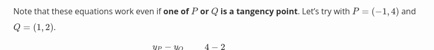

- [url](https://andrea.corbellini.name/2015/05/17/elliptic-curve-cryptography-a-gentle-introduction/)
- #+BEGIN_IMPORTANT
  Described by the equation:
  #+END_IMPORTANT 
  #+BEGIN_EXPORT latex
  y^{2} = x^{3} + ax + b
  #+END_EXPORT
  where 
  #+BEGIN_EXPORT latex
  4a^{3} + 27b^{2} \neq 0
  #+END_EXPORT
- #+BEGIN_NOTE
  Defn: The *Weierstrass normal form* is the equation above
  #+END_NOTE
- They are symetrric along the x-axis
- #+BEGIN_IMPORTANT
  we also need a *point at infinity* to be part of this curve which denoted as 0
  #+END_IMPORTANT
- Now all that can be written as 
  
- Groups:
	- we have binary operation of addition or + which is defined by:
	  id:: 6400be2b-db3a-4349-bc2e-c6ed145f3dd5
		- *closure*: if *a* and *b* are members of *G* then *a* + *b* is member of *G*
		- *associativity*: (a + b) + c = a + (b + c)
		- there's an *identity element* 0 such that a + 0 = 0 + a = a
		- every element has *iverse*, for every *a* there exists *b* such that *a* + *b* = 0
		- abelian requirement:
		  id:: 6400be2b-0692-40f6-a695-fc7bcbc648de
		- *communativity*: a + b = b + a
		- from these can be derived
			- the *identity element is unique*
			- *inverses are unique*
- Group law for elliptic curves:
	- elemets of group are the points of an elliptic curve
	- identity element is point at infinity 0
	- invers of a point *P* is the one symmetric about the *x*-axis
	- addition rule: given three alligned, non-zero points *P*, *Q*, *R*, their sum is P + Q + R = 0
		- don't need an order and whern they are aligned....
		  P + (Q + R) = Q + (P + R) = R + (P + Q) = 0 which means ...
		  abelian group with associastivity and communitative
- Geometric addition:
	- Defn: [Affine](https://mathworld.wolfram.com/Affine.html)
	  #+BEGIN_IMPORTANT
	  can be represented as a tuple of coordinates, assuming linear space
	  #+END_IMPORTANT
	- So if P + Q + R = 0...we can have P + Q = -R (the inverse)
	- 
	- But because of this we also need to ask..
		- What if P = 0 or Q = 0...?  P + 0 = P and 0 + Q = Q for all P and Q
		- what if P = -Q? That's vertical and doesn't pass through a third point
		- What if P = Q? There's infintely many lines... But consider Q' != P.
		  If Q' approaches P then it get closer to it
			- As Q' goes towards P, the line passing through P and Q' becomes tangent to curve.
			- 
		- 
		- [[draws/2023-03-06-11-39-18.excalidraw]]
	- Algebraic addition:
		- We transform above rules into set of equations
		  id:: 6406183f-4aa5-4698-9be9-c5e4c0a7f702
			- Consider only non-zero, non-symettric points
			  #+BEGIN_EXPORT latex
			  P = (x_{P}, y_{P}) \ \ \ Q = (x_{Q}, y_{Q})
			  #+END_EXPORT
			  which assuming they are distinct, the line through them has a slope:
			  #+BEGIN_EXPORT latex
			  m = \frac{y_{P} - y_{Q}}{x_{P} - x_{Q}}
			  #+END_EXPORT
			- Intersection of this line with the curve is third point R:
			  #+BEGIN_EXPORT latex
			  x_{R} = m^{2} - x_{P} - x_{Q} \\
			  y_{R} = y_{P} + m(x_{R} - x_{P})
			  #+END_EXPORT
				- Or...
				  #+BEGIN_EXPORT latex
				  y_{R} = y_{Q} + m(x_{R} -x_{Q})
				  #+END_EXPORT
				- hence....
				  #+BEGIN_EXPORT latex
				  (x_{P}, y_{P}) + (x_{Q}, y_{Q}) = (x_{R}, \underline{-y{R}})
				  #+END_EXPORT
				- #+BEGIN_EXAMPLE
				  elliptic curve y^2 = x^3 - 7x + 10
				  #+END_EXAMPLE 
				  {:height 354, :width 654}
				- so ... using [above](logseq://graph/pages?block-id=6406183f-4aa5-4698-9be9-c5e4c0a7f702) equations...
				  #+BEGIN_EXPORT latex
				  m = \frac{2 - 4}{1 - 3} = 1 \\
				  x_{R} = 1^{2} - 1 - 3 = -3 \\
				  y_{R} = 2 + 1 * (-3 - 1) = -2 \\
				  = 4 + 1 * (-3 - 3) = -2
				  #+END_EXPORT
				- So ... -R = (-3, 2)
				- 
				- 
				- {:height 70, :width 654}
					- #+BEGIN_EXPORT latex
					  m = \frac{3x^{2}_{P} + a}{2y_{P}}
					  #+END_EXPORT
					  which is derived from :
					  
					  #+BEGIN_EXPORT latex
					  y_{P} = \pm \sqrt{x^{3}_{P} + ax_{P} + b }
					  #+END_EXPORT
					  TO check this we can check that R belongs to curve and that line passing through P and R has only two intersections with curve...
					  For example if P = Q = (1, 2)
					  
					- #+BEGIN_EXPORT latex
					  m = \frac{3 * 1^{2} - 7}{2 * 2}  = 1 \\ \ \\
					   
					  x_{R} = (-1)^{2} - 1 - 1 = -1 \\
					  y_{R} = 2 + (-1) * (-1 - 1) = 4
					  #+END_EXPORT
					  P + P = -R = (-1, -4)
		- Scalar multiplication:
			- #+BEGIN_EXPORT latex
			  nP = P + P + P ... P \ for \ n \ times
			  #+END_EXPORT
			- where *n* is a natural number
			  id:: 640622ce-f51c-4f2c-be9f-3d17bd41936b
			- There's quick algorithms fior this specific operation...
			  id:: 640622ce-f51c-4f2c-be9f-3d17bd41936b
				- *double and add*
				  For example if *n* = 151 whos binary repersentation is 10010111_2
				  
				  #+BEGIN_EXPORT latex
				  151 = 1 * 2^{7} + 0 * 2^{6} + 0... \\
				  = 2^{7} + 2^{4} + 2^{2} + 2^{1} + 2^{0}
				  #+END_EXPORT
				- so...
					- #+BEGIN_EXPORT latex
					  151 * P = 2^{7}P + 2^{4}P + 2^{2}P + 2^{1}P + 2^{0}P
					  #+END_EXPORT
					- 
			- Lograithmically:
				- Becomes computationally hard to find a *n*  given that we know Q and P
		- Finite Fields and discrete logarithms
			- Field of intergbers modulo p
				- set of intergers modulo *p*, where p is a prime number,
				  denoted as
				  #+BEGIN_EXPORT latex
				  Z/p, \ GF(p), \ or F_{p}
				  #+END_EXPORT
				- in this field we have two binary operations, addition and multiplication. These operations are close, associative, and communative. There also exists an unique identity elements, and for every element there's an unique inverse element. and... x * (y + z) = x * y + x * z
				- intergers modulo *p* consist of all intergers 0 to p -1.
				  *For example*: operations in F_{23}
					- addition: (18 + 9) mod 23 = 4
					- subtraction: (7 -14) mod 23 = 16
					- multiplication: 4 * 7 mod 23 = 5
					- additive inverse: -5 mod 23 = 18
						- (5 + (-5)) mod 23 = (5 + 18) mod 23
					- multipclative inverse: 9^{-1} mod 23 = 18
						- 9 * 9^{-1} mod 23 = 9 * 18 mod 23 = 1
				- Division modulo p:
					- what does x/y mean in F_{p}:
					  x/y = x * y^{-1}
					- 
				- Elliptic curves in F_{p}
					- 
					- #+BEGIN_EXPORT latex
					  \lbrace (x,y) \in (\mathbb{F}_{p})^{2} \mid y^{2} \equiv x^{3} + ax + b (mod p), \\ \ \\ 4a^{3}+ 27b^{2} \ncong 0 (mod \ p) \rbrace \cup \lbrace 0 \rbrace
					  #+END_EXPORT
					- 0 is till point at infinity and *a*, *b* are two intergers in F_{p}
					- 
					- elliptic curves in F_{p} form an [ableian group](logseq://graph/pages?block-id=6400be2b-0692-40f6-a695-fc7bcbc648de) (communative)
				- Point addition:
					- Three points are alligned if there is line connecting all of them
					- Lines in F_{p} is the set of points (x, y) that satisfy
					  #+BEGIN_EXPORT latex
					  ax + by + c \equiv 0 \ (mod \ p)
					  #+END_EXPORT
					- 
					- the point addition operation retains properties [above](logseq://graph/pages?block-id=6400be2b-db3a-4349-bc2e-c6ed145f3dd5):
					  #+BEGIN_EXPORT latex
					  Q + 0 = 0 + Q \ (Identity) \\ \ \\ -Q = (x_{Q}, -y_{Q} \ mod \ p)
					  #+END_EXPORT
					- 
				- Algebraic Sum
					- add "mod p" to point calculation [formulas](logseq://graph/pages?block-id=6406183f-4aa5-4698-9be9-c5e4c0a7f702)
					- 
				- The order of an elliptic curve group
					- #+BEGIN_IMPORTANT
					  Defn: number of points in a group is called the *order of the group*
					  And we can compute this number in polynomial time  using Schoof's [algorithm](https://www.mat.uniroma2.it/~schoof/ctg.pdf) 
					  #+END_IMPORTANT
				- Scalar multlipication and cyclic subgroups
					- multiplication defined as :
					  
					  #+BEGIN_EXPORT latex
					  nP = P \ + \ P \ + \ ....\ +\ P \ for \ n \ times
					  #+END_EXPORT
					-