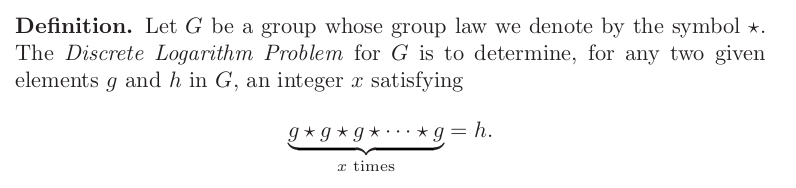

- 2.1
	- 
	- #+BEGIN_QUOTE
	  Defn: *one way function*: easy to compute but hard to inverse is difficult to hard
	  #+END_QUOTE
	- #+BEGIN_QUOTE
	  Defn: *trapdoor*: auxillary information that allows inverse to be computed easily
	  #+END_QUOTE
	- Decryption function *d_kpriv* is easily computable with private key *k_priv* but is difficult to compute with someone with only public key *k_pub*
	- *k_priv* would be the *trapdoor information* for the encryption function *e_kpub* because without it, would be very difficult to compute the inverse of *e_kpub*
	- A proof of if one-way functions exist (can be verified) would solve *P = NP* problem lol
	- so basically we assume cryptosystems will fail to be disproven to run at X time and explain or generate unexpected behavior...like models of physics
	- Some one-way functions proposed by diffie-hellman:
		- knapsack problem
		- exponiation mod *q*
	- public key method described by diffie hellman called the *Diffie-Hellman key xchange*
		- based on discrete log problem being difficult to solve
- 2.2 Discrete Log problem
	- The Diffie Hellman public key construction is based on discrete lograthm problem in finite field *F_p* (field with prime number of elements) or *Z/pZ*
	- #+BEGIN_IMPORTANT
	  Let *p* be a large prime, there exists a primative (generator)  *g*. Every nonzero element of *F_p* is equal to some power of *g*. Most importantly *g^p-1* = 1 by fermats little therom, and no smaller power of *g* is equal to 1. The list of elements 
	  1,*g*, *g^2*,*g^3*...*g^p-2*∈ *F_p**
	  is a complerte list of element s in *F_p* in some order
	  #+END_IMPORTANT
	- #+BEGIN_IMPORTANT
	  Defn: Let *g* be a primative root for *F_p* and let *h* be a nonzero element in *F_p*. The *Discrete logarithm problem* is the problem of finding an exponent *x* such that *g^x* ≡ *h* (mod *p*). The number *x* is called the discrete logarithm of *h* to the base *g* and is denoted by log_*g*(*h*)
	  
	  Log_*a**b* = *x* ≡ *a^x* = *b* in *Z_p**
	  #+END_IMPORTANT
		- #+BEGIN_NOTE
		  An older term for the discrete logarithm is the index, denoted
		  by ind g (h). The index terminology is still commonly used in number theory.
		  #+END_NOTE
		- #+BEGIN_NOTE
		  If there is a solution to Discrete logarithm, there are infinitely many because of Fermats Little theorem (*g*^*p-1* ≡ 1 mod *p*), if there is an *x* for *g^x* = *h*, then *x* + *k*(*p-1*) is a solution for every value of *k*, because
		  *g^x+k(p-1)* = *g^x* * (*g^p-1*)^*k*≡*h* * 1^*k* ≡ *h* (mod *p*).
		  #+END_NOTE
		- #+BEGIN_NOTE
		  {{video https://www.youtube.com/watch?v=cb42FcUda14&list=PL1xkDS1G9As7E_fPaLaFchq1a27I9a5tO&index=2}} for figuring out generators
		  
		  *a* ∈ *Z_p* is a *generator* if {*a*, *a^2*...*a^p-1*}=*Z_p** = {1,2,...*p-1*}
		  (*Z_p**, *) is a cyclic group
		  #+END_NOTE
			- #+BEGIN_NOTE
			  Testing for generator:
			  *a* is a generator of *Z_p** if and only if *a*^*p-1*/*q* != 1(mod *p*) for all primes *q* such that *q*/(*p-1*)
			  #+END_NOTE
		- #+BEGIN_EXAMPLE
		  *Z_19** = {1,2...18}
		  *a* = 14 is a generator of *Z_19**
		  *a*^10 = 14^10 mod 19
		  = 5 (in *Z_19**)
		  Log_14 5 = 10
		  #+END_EXAMPLE
		- Log_*g*(*h*) is defined by only adding or subtracting multiple of *p-1
		  or...only defined for *p-1*
			- #+BEGIN_NOTE
			  log_*g*: *F_p** -> Z/(*p-1*)*Z*
			  #+END_NOTE
		- #+BEGIN_NOTE
		  *discrete logarithm* log_g is a proup isomorphism from *F_p** to *Z*/(*p-1*)*Z*
		  #+END_NOTE
		- #+BEGIN_EXAMPLE
		  the number *p* = 56509 is prime and has a generator *g* = 2 modulo *p*, we can calculate discrete logarithm of *h* = 38679
		  2^2,2^3....(mod 56509) until we find power that equals 38679.
		  log_*p*(*h*) = 11235
		  2^11235 mod 56509 is equal to 38679
		  #+END_EXAMPLE
	- 
- 2.3 Diffie-Hellman key exchange
	-