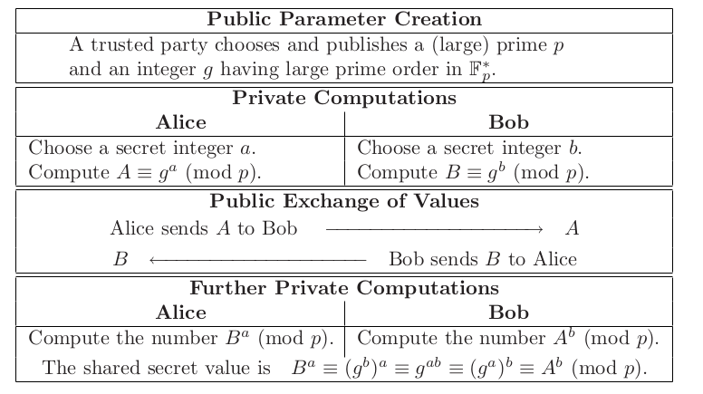
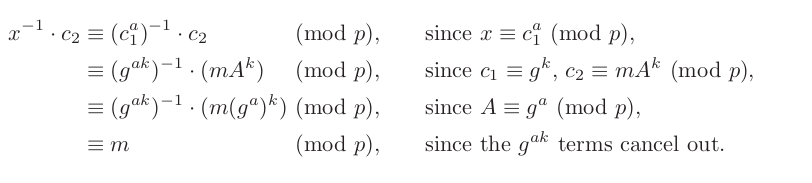
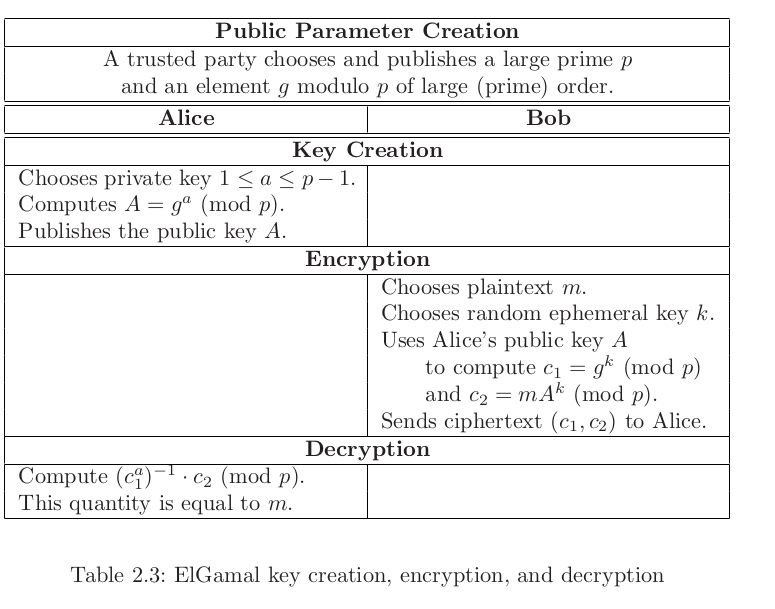
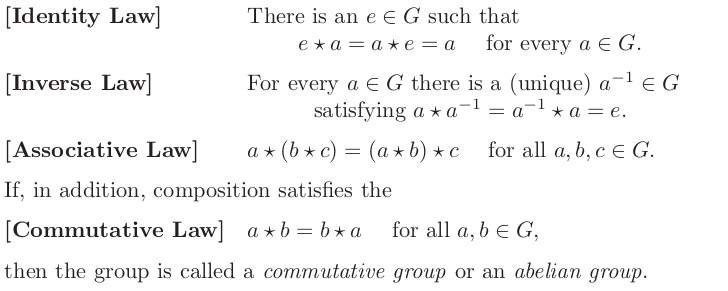
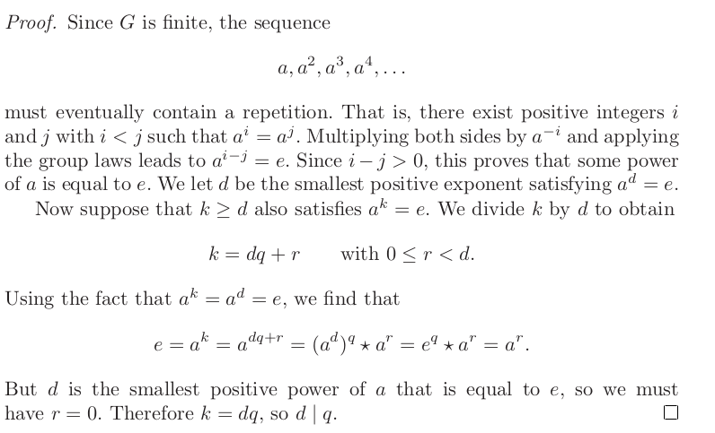
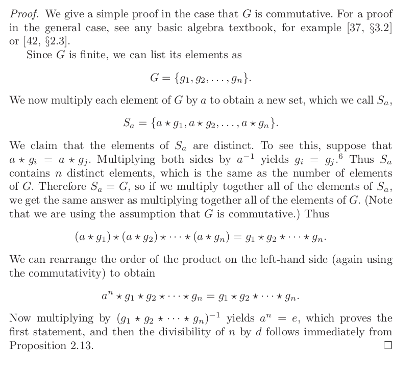
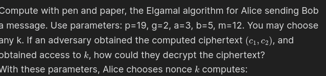
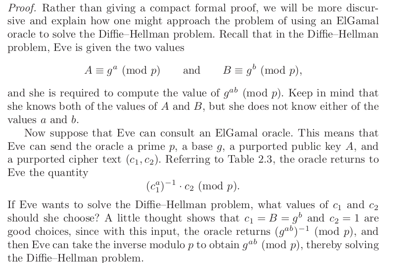

- 2.1
	- 
	- #+BEGIN_QUOTE
	  Defn: *one way function*: easy to compute but hard to inverse is difficult to hard
	  #+END_QUOTE
	- #+BEGIN_QUOTE
	  Defn: *trapdoor*: auxillary information that allows inverse to be computed easily
	  #+END_QUOTE
	- Decryption function *d_kpriv* is easily computable with private key *k_priv* but is difficult to compute with someone with only public key *k_pub*
	- *k_priv* would be the *trapdoor information* for the encryption function *e_kpub* because without it, would be very difficult to compute the inverse of *e_kpub*
	- A proof of if one-way functions exist (can be verified) would solve *P = NP* problem lol
	- so basically we assume cryptosystems will fail to be disproven to run at X time and explain or generate unexpected behavior...like models of physics
	- Some one-way functions proposed by diffie-hellman:
		- knapsack problem
		- exponiation mod *q*
	- public key method described by diffie hellman called the *Diffie-Hellman key xchange*
		- based on discrete log problem being difficult to solve
- 2.2 Discrete Log problem
	- The Diffie Hellman public key construction is based on discrete lograthm problem in finite field *F_p* (field with prime number of elements) or *Z/pZ*
	- #+BEGIN_IMPORTANT
	  Let *p* be a large prime, there exists a primative (generator)  *g*. Every nonzero element of *F_p* is equal to some power of *g*. Most importantly *g^p-1* = 1 by fermats little therom, and no smaller power of *g* is equal to 1. The list of elements 
	  1,*g*, *g^2*,*g^3*...*g^p-2*∈ *F_p**
	  is a complerte list of element s in *F_p* in some order
	  #+END_IMPORTANT
	- #+BEGIN_IMPORTANT
	  Defn: Let *g* be a primative root for *F_p* and let *h* be a nonzero element in *F_p*. The *Discrete logarithm problem* is the problem of finding an exponent *x* such that *g^x* ≡ *h* (mod *p*). The number *x* is called the discrete logarithm of *h* to the base *g* and is denoted by log_*g*(*h*)
	  
	  Log_*a**b* = *x* ≡ *a^x* = *b* in *Z_p**
	  #+END_IMPORTANT
		- #+BEGIN_NOTE
		  An older term for the discrete logarithm is the index, denoted
		  by ind g (h). The index terminology is still commonly used in number theory.
		  #+END_NOTE
		- #+BEGIN_NOTE
		  If there is a solution to Discrete logarithm, there are infinitely many because of Fermats Little theorem (*g*^*p-1* ≡ 1 mod *p*), if there is an *x* for *g^x* = *h*, then *x* + *k*(*p-1*) is a solution for every value of *k*, because
		  *g^x+k(p-1)* = *g^x* * (*g^p-1*)^*k*≡*h* * 1^*k* ≡ *h* (mod *p*).
		  #+END_NOTE
		- #+BEGIN_NOTE
		  {{video https://www.youtube.com/watch?v=cb42FcUda14&list=PL1xkDS1G9As7E_fPaLaFchq1a27I9a5tO&index=2}} for figuring out generators
		  
		  *a* ∈ *Z_p* is a *generator* if {*a*, *a^2*...*a^p-1*}=*Z_p** = {1,2,...*p-1*}
		  (*Z_p**, *) is a cyclic group
		  #+END_NOTE
			- #+BEGIN_NOTE
			  Testing for generator:
			  *a* is a generator of *Z_p** if and only if *a*^*p-1*/*q* != 1(mod *p*) for all primes *q* such that *q*/(*p-1*)
			  #+END_NOTE
		- #+BEGIN_EXAMPLE
		  *Z_19** = {1,2...18}
		  *a* = 14 is a generator of *Z_19**
		  *a*^10 = 14^10 mod 19
		  = 5 (in *Z_19**)
		  Log_14 5 = 10
		  #+END_EXAMPLE
		- Log_*g*(*h*) is defined by only adding or subtracting multiple of *p-1
		  or...only defined for *p-1*
			- #+BEGIN_NOTE
			  log_*g*: *F_p** -> Z/(*p-1*)*Z*
			  #+END_NOTE
		- #+BEGIN_NOTE
		  *discrete logarithm* log_g is a proup isomorphism from *F_p** to *Z*/(*p-1*)*Z*
		  #+END_NOTE
		- #+BEGIN_EXAMPLE
		  the number *p* = 56509 is prime and has a generator *g* = 2 modulo *p*, we can calculate discrete logarithm of *h* = 38679
		  2^2,2^3....(mod 56509) until we find power that equals 38679.
		  log_*p*(*h*) = 11235
		  2^11235 mod 56509 is equal to 38679
		  #+END_EXAMPLE
	- 
- 2.3 Diffie-Hellman key exchange
	- 
	- Assume that all info shared between Alice and Bob is public, could be monitered by advesary Eve
		- Alice and bob agree on large prime *p* and nonzero interger *g* modulo *p*, assume that Eve would know this as well
		- #+BEGIN_NOTE
		  best if they choose *g* such that its order in *F_p** is large prime
		  #+END_NOTE
		- Next: Alice picks secret interger *a* that she doesn't reveal to anyone, while bob picks interger *b* that is secret. Bob and alice computes:
		  *A* ≡ *g^a*(mod *p*) and *B* ≡ *g^b* (mod *p*)
		- Next: exchange computed values, Alices sends *A* to Bob and Bob sends *B* to Alice. Assume Eve can see values of *A* and *B*.
		- FInally: Bob and Alice use secret intergers to compute:
		  *A'* ≡ *B^a*(mod *p*) and *B'* ≡ *A^b* (mod *p*)
		- *A'* ≡ *B^a* ≡ (*g^b*)^*a* ≡ *g^ab* ≡ (*g^a*)^*b* ≡ *A^b*  ≡ *B'* (mod *p*)
		- #+BEGIN_EXAMPLE
		  Alice + Bob agree on *p* = 941 and primative root *g* = 627. Alice chooses secret key *a* = 347 and computes *A* = 390 ≡ 627^347(mod 941). Bob chooses secret key *b* = 781 and computes *B* = 691 ≡ 627^781 (mod 941). Alice sends bob the number 390 and Bob sends Alice the number 691. We assume that Eve could see this. Secrets are not transmitted. 
		  
		  Then ALice and Bob are able to compute:
		  470 ≡ 627^347 * 781 ≡ *A^b* ≡ *B^a* (mod 941)
		  so 470 is their shared secret.
		  
		  If Eve were able to see exchange, she could reconstitute ALice and Bob's shared secret by solving either of these congruences:
		  627^*a* ≡ 390 (mod 941) or 627^*b* ≡ 691 (mod 941),
		  then find the one of their secret lograthims (exponent)
		  #+END_EXAMPLE
		- #+BEGIN_IMPORTANT
		  Defn: Let *p* be a prime number and *g* and interger. *Diffie-hellman problem* is the problem of computing the value *g^ab* (mod *p*) (shared secret) from known values of *g^a* (mod *p*) and *g^b*(mod *p*)
		  #+END_IMPORTANT
		- #+BEGIN_NOTE
		  DHP and Discrete log problem (DLP) are comparable in difficulty to compute
		  If Eve can solve DLP, she can compute secret exponents *a* and *b* from intercepted values
		  *A* = *g^a* and *B* = *g^b*...easy to compute shared keys *g^ab*
		  But converse is less clear...if can solve DHP, can you easily solve DLP
		  #+END_NOTE
- 2.4 ElGaml public key Cryptographic system
	- Alice begins by publishing info of public key and algorithm
	- Public key is simply a number, and algorithm is method by which Bob encrypts his messages using Alice's public key. Alice keeps private key *a*, which decrypts messages that have been encrypted with her public key *A*
	- Bob wants to encrypt a message using Alice's public key *A*. We will assume Bob's message *m* is an interger between 2 and *p*. In order to encrypt *m*, Bob randomly chooses another number *k* modulo *p*. Bob uses *k* to encrypt  one and only one message and then discards it. *k* is an ephemeral key and only exists for encrypting a single number.
	- Bob takes *m*, ephemeral key *k* and Alice's public key *A* and uses them to compute 
	  *c_1* ≡ *g^k* (mod  *p*) and *c_2* ≡ *m**A*^*k* (mod *p*)
	  *g* and *p* are public parameters* and Bob knows this
	- Alice decrypts this with *a* by computing
	  *x* ≡ *c_1^a* (mod *p*) and *x^-1* (mod *p*). Alice then multiplies *c_2* by *x^-1* and the resulting value of plaintext *m*
	- 
	-
	- 
	- So how would Eve decrpt this? Eve knows *p*  and *g* and knows value of *A* ≡ *g^a* (mod *p*)
-
-
- 2.5 Theory of Groups
	- Multiplication in *F_p** has attributes:
		- element 1 ∈ *F_p** satisfying 1 * *a* = a for every a ∈ F_p*
		- every a ∈ F_p* has an inverse *a*^-1 ∈ F_p* satisfying a * a^-1 = a^-1 * a = 1
		- multiplication is assoacative: a * (b * c)  = (a * b) * c for all a,b,c ∈ F_p*
		- multiplication is communative: a * b = b * a for all a,b ∈ F_p*
	- Addition if we replace 0 for 1 and -a for a^-1, all the four properties are still true
		- #+BEGIN_IMPORTANT
		  Defn: a *group* consists of set *G* and a rule, which could be * for combining two elements a,b ∈ *G*  to obtain element a * b ∈ *G*. The * operation has to have three properties:
		   
		  #+END_IMPORTANT
	- Defn: If *G* has finetly many element, we say *G* is a *finite group*. The *order* of *G* is the number of elements in *G*and is denoted by |*G*|
	- Let *g* be an element of a group *G* and let *x* be a positive interger. Then *g^x* means that we apply group operation *x* times to the element *g*,
	  *g^x* = g * g * g..... {*x* repitions}
	  
	  #+BEGIN_EXAMPLE
	  Exponiation *g^x* in the group *F_p** has the usual meaning, multipkly *g*  by itself *x* time. But exponiation *g^x* in the group *Z/NZ*means to <ins> add </ins> *g* to itself *x* times.
	  #+END_EXAMPLE
	- #+BEGIN_NOTE
	  Exponiation in a group is repeated application of the group operation to an element of the group
	  #+END_NOTE
	- Defn: Let *G* be a group and let *a* ∈ *G* be an element of the group. Suppose there exists a positive interger *d* with the property *a^d* = *e*. The smallest such *d* is called the *order* of *a*. If there is no such *d*, then *a* is said to have *infinite order*
	- #+BEGIN_NOTE
	  Let *G* be a finite group. Then every element of *G*  has finite order, Further if *a* ∈ G has order *d* and if *a^k* = *e*, then *d* / *k* 
	  #+END_NOTE
	- 
	- #+BEGIN_NOTE
	  Lagrange's Theorem: Let *G* be a finite group and *a* ∈ *G* , then the order of *a*  divides order of *G*.
	  n = |G| is order of *G* and let the *d* be the order of *a*, ie *a^d* is the smallest positive power of *a* that is equal to *e*. Then
	  *a^n* = *e* and *d*/*n*
	  #+END_NOTE
	- 
- # Lecture notes
	- what we cover next week: probalistic figuring of security!
	- need to actually do pen and paper!
	- next week: earlier lectures!
	- shamir's sharing and pederson commitment vectors
		- adversary would be commiter that looks for value that probabiliticly searches for hash collisions
	- Pedersen are zero knowledge proofs
	- Do signatures by hand! wew!
-
- # Homework problems
	- 
		- (*c_1*)  = *g^k* (mod *p*) * (*c_2*)
			- k = 10   
			  (*c_1*, *c_2*) = (*g^k*, *m*B*^k) mod p
			                         ≡ (2^10, 12*(2^5)^10 (mod 19) = (17, 15)
			- Bob then computes: *x* = *c_1*^-1 
			  17^-1 (mod 19) = 9 = 19 - (1)*17 mod 19 multiplied by c_2 ≡ (c_1^b)       
			  ≡ (2^5 * 10)^-1
			  
			  If adversary could compute *B*^-k...strip *c_2* of encrypted 
			-
	-