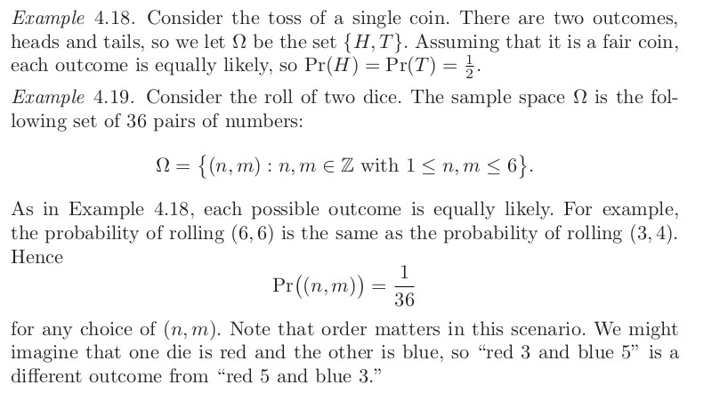

- # Book notes
- 4.0 Combonatrics, probability
	- 4.1 Basic principles of counting
	- #+BEGIN_IMPORTANT
	  Basic counting principle: if two experiments are performed, one of which has *n* possible outcomes and the other has *m* possible outcomes, then there are *nm* possible outcomes of performing both experiments.  
	  #+END_IMPORTANT
	- 4.1.1 Permutations
		- Each possible configuration of given list of objects is called a *permutation*
-
-
	- 4.3...Probability theory
		- 4.3.1
			- *Probability space* consists of two pieces. Finite set Ω consists of all possible outcomes of an experiment and the second is assigning probability of each possible outcome. A probability space is finite set of outcomes Ω is called the *sample space*. And a function Pr : Ω −→ *R*.
			  id:: 63f668b2-8f45-49d0-8b82-64898d74c58c
			  We want that function *Pr* to satisfy intuition that 
			  Pr(*w*) = "probability that event *w* occurred"
			- 
			  id:: 63f688f6-c4c0-45a4-89a9-8e73701e442b
				- #+BEGIN_EXAMPLE
				  100 balls , 21 of which are white, rest are black.
				  If we pick 10 balls (without replacement) what is probability exactly 3 are white.
				  
				  Total numbers of ways of selecting 10 balls from among 100 is (100/10)
				  there are (21/3) ways to select 3 white balls from the 21 that are white
				  and (79/7) ways to pick the other 7 balls from the 79 that are black
				  (21/3)*(79/7) ways to select exactly 3 white balls and exactly 7 black balls. 
				  Picking exactly 3 white balls in 10 tries is:
				  Pr(exactly 3 white balls in 10 attempts)= (21/3)*(79/7)  / (100/10) = .223
				  #+END_EXAMPLE
			- *compound events* are subsets of the sample space that may include more than one outcome.
				- In roll of two dice in )) we might be interested in probability that at least one of the dice shows a 6. The compound event is the subset of Ω consisting of all outcomes that include the number six, which is the set
				  {(1, 6), (2, 6), (3, 6), (4, 6), (5, 6), (6, 6), (6, 1), (6, 2), (6, 3), (6, 4), (6, 5)}
				- We compute the probability of compound events in repeated independent trials with the *independence of events*
					- #+BEGIN_NOTE
					  Defn: A *sample space* or *set of outcomes* is a finite set Ω. Each outcome *w* ∈ Ω is assigned a probability Pr(*w*) which require probability function 
					  Pr : Ω −→ R
					  satisfy following two properties: 
					  #+END_NOTE
						- 0 <= Pr(*w*) <= 1 for all *w* in Ω
						- #+BEGIN_EXPORT latex
						  {\omega \epsilon \varOmega}\sum Pr(\omega) = 1
						  #+END_EXPORT
						-
				-
				-
				-
				-
		-