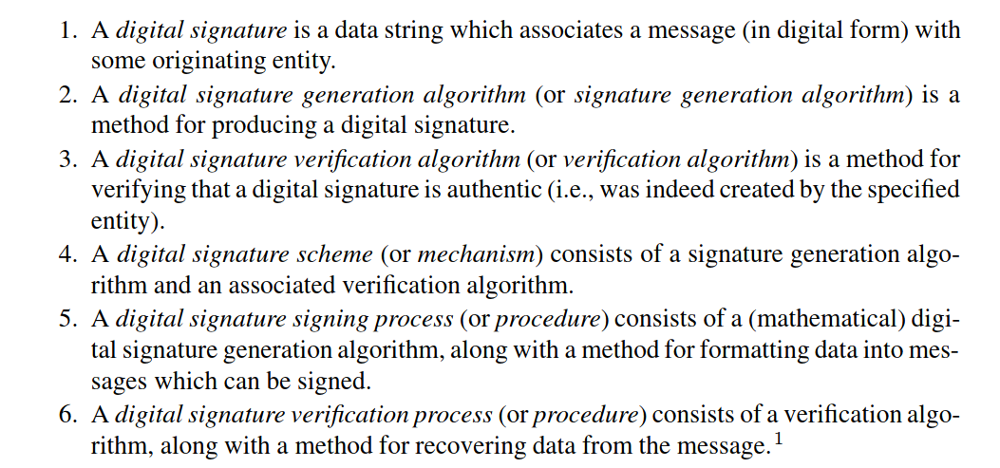

- # Book notes
- 4.0 Combonatrics, probability
	- 4.1 Basic principles of counting
	- #+BEGIN_IMPORTANT
	  Basic counting principle: if two experiments are performed, one of which has *n* possible outcomes and the other has *m* possible outcomes, then there are *nm* possible outcomes of performing both experiments.  
	  #+END_IMPORTANT
	- 4.1.1 Permutations
		- Each possible configuration of given list of objects is called a *permutation*
-
-
	- 4.3...Probability theory
		- 4.3.1
			- *Probability space* consists of two pieces. Finite set Ω consists of all possible outcomes of an experiment and the second is assigning probability of each possible outcome. A probability space is finite set of outcomes Ω is called the *sample space*. And a function Pr : Ω −→ *R*.
			  id:: 63f668b2-8f45-49d0-8b82-64898d74c58c
			  We want that function *Pr* to satisfy intuition that 
			  Pr(*w*) = "probability that event *w* occurred"
			- 
			  id:: 63f688f6-c4c0-45a4-89a9-8e73701e442b
				- #+BEGIN_EXAMPLE
				  100 balls , 21 of which are white, rest are black.
				  If we pick 10 balls (without replacement) what is probability exactly 3 are white.
				  
				  Total numbers of ways of selecting 10 balls from among 100 is (100/10)
				  there are (21/3) ways to select 3 white balls from the 21 that are white
				  and (79/7) ways to pick the other 7 balls from the 79 that are black
				  (21/3)*(79/7) ways to select exactly 3 white balls and exactly 7 black balls. 
				  Picking exactly 3 white balls in 10 tries is:
				  Pr(exactly 3 white balls in 10 attempts)= (21/3)*(79/7)  / (100/10) = .223
				  #+END_EXAMPLE
			- *compound events* are subsets of the sample space that may include more than one outcome.
				- In roll of two dice in )) we might be interested in probability that at least one of the dice shows a 6. The compound event is the subset of Ω consisting of all outcomes that include the number six, which is the set
				  {(1, 6), (2, 6), (3, 6), (4, 6), (5, 6), (6, 6), (6, 1), (6, 2), (6, 3), (6, 4), (6, 5)}
				- We compute the probability of compound events in repeated independent trials with the *independence of events*
					- #+BEGIN_NOTE
					  Defn: A *sample space* or *set of outcomes* is a finite set Ω. Each outcome *w* ∈ Ω is assigned a probability Pr(*w*) which require probability function 
					  Pr : Ω −→ R
					  satisfy following two properties: 
					  #+END_NOTE
						- 0 <= Pr(*w*) <= 1 for all *w* in Ω
						- #+BEGIN_EXPORT latex
						  {\omega \epsilon \varOmega}\sum Pr(\omega) = 1
						  #+END_EXPORT
				- An *event* is a subset of Ω. We assign probability of event *E* ⊂ Ω by setting
				  
				  #+BEGIN_EXPORT latex
				  Pr(E) =  {\omega \epsilon \varOmega}\sum Pr(\omega)
				  #+END_EXPORT
				- in Particular Pr(null) = 0, and Pr(Ω) = 1
				- We say that two events *E* and *F* are disjoint if *E* ∩ *F* = null
				- Pr(*E* ∪ *F*) = Pr(*E*) + Pr(*F*) if *E* and *F* are disjoint
				  E ∪ F are outcomes in either E or F. When not disjoint the probability of *E ∪ F* isn't the sum because it shouldnm't be counted twice. So... we need :
				  Pr(*E* ∪ *F*) = Pr(*E*) + Pr(*F*) - Pr(*E* ∩ *F*)
			- The *complement* of an event *E* is the event E^c consisting of all outcomes not in *E*,
			  
			  #+BEGIN_EXPORT latex
			  E^{c} = \left\lbrace \omega \epsilon \varOmega  \colon \omega \cancel{\epsilon} E \right\rbrace
			  #+END_EXPORT
				- probability of complementry event is 
				  id:: 63f688ee-4669-4cf7-8e74-475c4474cae2
				  
				  #+BEGIN_EXPORT latex
				  Pr(E^{c}) = 1 - Pr(E)
				  #+END_EXPORT
				- We can use above [formula](logseq://graph/pages?block-id=63f688ee-4669-4cf7-8e74-475c4474cae2) to find Pr(*E*)
					- Example:
					  Ω consists of possible outcomes of rolling dice. Let *E*be the event
					  E = {at least one six is rolled}.
					  or, explicitly
					  E = {(1, 6), (6, 1), (2, 6), (6, 2), (3, 6), (6, 3), (4, 6), (6, 4), (5, 6), (6, 5), (6, 6)}, 
					  Each has a probability of (1/36) so...
					  
					  #+BEGIN_EXPORT latex
					  Pr(E) = {\omega \epsilon E}\sum Pr(\omega) = \frac{11}{36}
					  #+END_EXPORT
					  Probability of not rolling a six would be
					  
					  #+BEGIN_EXPORT latex
					  Pr(no sixes rolled) = Pr(E^{c}) = 1 - Pr(E) = \frac{25}{36}
					  #+END_EXPORT
					  Next we could consider event *F* defined by 
					  *F* = {no number higher than two is rolled} or
					  F = {(1, 1), (1, 2), (2, 1), (2, 2)}
					  Which is disjoint from *E*, so the probability of either is
					  
					  #+BEGIN_EXPORT latex
					  Pr(E \cup F ) = Pr(E) + Pr(F) = \frac{11}{36} + \frac{4}{36} = \frac{15}{36}
					  #+END_EXPORT
					  FOr nondisjoint events, the computation is more complicated since we need to avoid double counting outcomes
					  G = {doubles}  or {(1, 1), (2, 2), (3, 3), (4, 4), (5, 5), (6, 6)}. Then *E* and *G* both contains outcome (6, 6)so the union E or G only contains 16 outcomes, not 17 ...
					- TODO : DO MORE OF EXAMPLES
			- #+BEGIN_IMPORTANT
			  Defn: Two events *E* and *F* are said to be *independent* if
			  Pr(E ∩ F ) = Pr(E) · Pr(F )
			  Where recall that probability of the intersection Pr(E ∩ F ) is probability that both *E* and *F* occur.
			  #+END_IMPORTANT
				- Example: 
				  A coin is tossed 10 times and results are recorded. What are probabilities of following?
				  #+BEGIN_EXPORT latex
				  E_{1} = {first five tosses are all heads}\\E_{2} = {first five tosses are all heads and rest are tails}\\E_{3} = {Exactly five of the ten tosses are heads}\\
				  #+END_EXPORT
				  Result of any one toss is *independent*  of the result of any other toss so ....find probability of getting H on first five tosses by multiplyinmg probability of getting H on any one of these tosses so....
				  
				  #+BEGIN_EXPORT latex
				  Pr(E_{1}) = (\frac{1}{2})^5 = \frac{1}{32}
				  #+END_EXPORT
				  in order to find E_2....we need a sequence HHHHHTTTTT so...
				  
				  #+BEGIN_EXPORT latex
				  Pr(E_{2}) = (\frac{1}{2})^{10} = \frac{1}{1024}
				  #+END_EXPORT
				  but Pr(E_3)...exactly five H's to occur but places no restriction on when they occur. Count how many ways to distribute five H's and five T's into ten spots or how many different sequences we can form consisting of five H's and five T's. This is simply number of ways of choosing five locations from ten possible locations which is combinatriol symbol (10/5). So dividing number of outcomes satisfying E_3 by total number of outcomes....
				  
				  #+BEGIN_EXPORT latex
				  Pr(E_{3}) = (\frac{10}{5}) * \frac{1}{2^{10}} = \frac{252}{1024} = \frac{63}{256} \approx 0.246
				  #+END_EXPORT
			- 4.3.2 Bayes Formula
				- So there's a connection between probability of two events *E* and *F* occur simuntously and probability that one of them occurs if we know the other one   occured...or Pr(*E* ∩ *F*). This is called the *conditional probability* of *F* on *E*
				- id:: 63f7cffe-e25c-4bbb-81c9-ab3ef1d9db29
				  #+BEGIN_IMPORTANT
				  Defn: The *conditional probabilty* of *F* on *E is denoted by*
				  #+END_IMPORTANT
				  #+BEGIN_EXPORT latex
				  Pr(E \mid E) = Pr(F given E occured)
				  #+END_EXPORT
				  and given by formula....
				  #+BEGIN_EXPORT latex
				  Pr(F \mid E) = \frac{Pr(F \cap E)}{Pr(E)}
				  #+END_EXPORT
					- On left hand side...Assuming E occurs, so our sample space is E instead of Ω. We are asking for probability  that event F occurs in smaller universe of outcomes, so we should compute the proportion of events F that is included in event E, divided by total size of event E on [right hand side](logseq://graph/pages?block-id=63f7cffe-e25c-4bbb-81c9-ab3ef1d9db29)
						- [Formula](logseq://graph/pages?block-id=63f7cffe-e25c-4bbb-81c9-ab3ef1d9db29) implies 
						  id:: 63f8d31d-f63d-4d79-9ae5-d76e1abc74f7
						  #+BEGIN_EXPORT latex
						  Pr(F \mid E)Pr(E) = Pr(F \cap E) = Pr(E \cap E) = Pr(E \mid F)Pr(F)
						  #+END_EXPORT
						  #+BEGIN_IMPORTANT
						  Dividing both sides by Pr(F) gives preliminary version of *Baye's formula*:
						  #+END_IMPORTANT
						  #+BEGIN_EXPORT latex
						  Pr(E \mid F) = \frac{Pr(F \mid E)Pr(E)}{Pr(F)}     (Bayes's)
						  #+END_EXPORT
						  Which is useful for conditional probability of F on E and want to know reverse conditional probability of E on F
						- #+BEGIN_NOTE
						  Proposition: Let *E* and *F* be events
						  #+END_NOTE
							- (a)
							  #+BEGIN_EXPORT latex
							  Pr(E) = Pr(E \mid F)Pr(F) + Pr(E \mid F^{c})Pr(F^{c})
							  #+END_EXPORT
							  (b)
							  
							  #+BEGIN_EXPORT latex
							  Pr(E \mid F) =  \frac{Pr(F \mid E)(Pr(E)}{Pr(F \mid E)(Pr(E) + Pr(F \mid E^{c})Pr(E^{c})}
							  #+END_EXPORT
								- Proof for (a):
								  
								  #+BEGIN_EXPORT latex
								  Pr(E \mid F)Pr(F) + Pr(E \mid F^{c})Pr(F^{c}) \\
								  = Pr(E \cap F) + Pr(E \cap F^{c})  ( Bayes's) \\
								  =Pr((E \cap F) \cup (E \cap F^{c})) \\
								  =Pr(E)
								  #+END_EXPORT
								- Proof for (b):
								  reverse the roles of E and F in (a) to get 
								  #+BEGIN_EXPORT latex
								  Pr(F) = Pr(F \mid E)Pr(E) + Pr(F \mid E^{c})Pr(E^{c})
								  #+END_EXPORT
			- 7.1 Digital signatures:
				- Defn: a *digital signature* is a data string which associates a message with some entity
				  
	- # Notes on homework from lecture...
		- statistical sewcurity...implies computational security...adversary can't distinguish from random noise