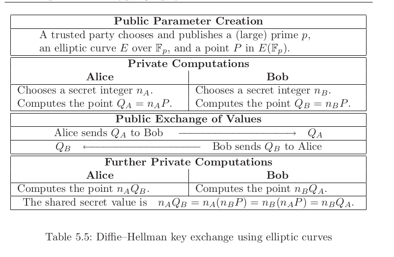

- Elliptic curves!
	- They're linear one way functions with shorter outputs and faster group operations than multiplicative groups for same security
		- over finite fields
		- prefer modulus of 2 ^ multiples of 64
		- finding generator is a problem just like [discrete log problem]((logseq://graph/pages?block-id=63f63d7b-c1b4-493d-9134-371bcf54f6be))
		- can compute arbitrary points
	- Weirstrass form and mongemtrory curve multiplication
	-
	- [honestly I need to read this and go through all of it](https://explained-from-first-principles.com/number-theory/#elliptic-curves)
	- Elliptic curve discrete log problem:
		- instead of multiplicative notation for discrete log, we use additive notation
		  and we can use [EEA](logseq://graph/pages?block-id=63ea7bec-9092-419f-8b74-91564cdc5767) to reverse addition
		- Shanks [baby-step](https://explained-from-first-principles.com/number-theory/#baby-step-giant-step) used as well...
		- 
		- Dot products too....preserves properties in 1 dimension of one plane...
		- tools:
			- trait gathering libraries...understand what traits mean and implement those
			- implementation details and scalar arithmetic, take a spec (FiatCrypto) (zcash) and implement