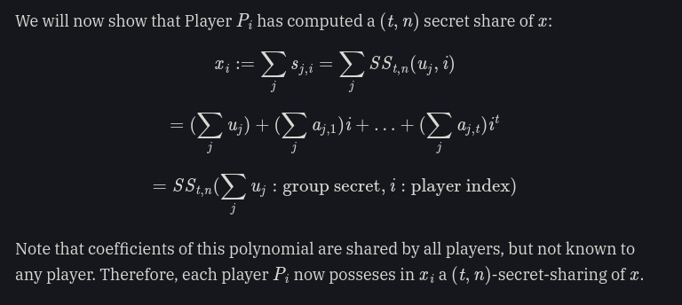

- # Lecture:
	- shamirs shared secret
	- MULTI PARTY COMPUTATION-
	  group of people maintains secret, each party holds onto one share of key to aggrate to one signature'
	- central verifier checks if multiple parties signatures are valid, then outputs final signature
		- but central verifer has to be trusted and needs verify T fro every signatur
	- Threshold signatures
		- need particular shares if we want any t-shares with shares not showing particular information on private keys
		- we can try encoding with error correcting codes (bit padding that show some fraction to reconstruct information about string)
			- each party obtains something that would allow them to reveal whole of t
			- extra storage cost
		- shamirs secret sharing: lets encode secret in a point *x* in some function with higher degrees of freedom (or polynomial)
		- any two distinct points along line will reconstruct lines
		- want T of N (construct degree T polynomial, hand out N points)
		- T-1 (3 out of 4) participants can't brute force in polynomial time
		- give the *n* participants one of t-1
		- Want everyone to contribute randomness toward secret
			- come with private value u_{i} and private coefficents a_{i}
			- private polynomials they construct
		- then they need to share public values , public keys
		- if alice has her polynomial, she can send other players evaluation at index *i* (p_{i}(i)
		- each player has some evaluation of their polynomial coorosponding to their index
		- player(*x*) = b_{0} + b_{1}x + .... b_{t}x
		- BLS signature (aggregation)
			- want: non-interctive signature aggregation
			- want Alice (\sigma_{a},m)
			- bob (\sigma_{b}, m)
			- output final signature
			- we can use pairing signatures!
			- pairing signatures could be plotted as dot products by exponiant *e*
			- using additive notation
-
-
- # Literature notes:
	- Shamir's ss and Pedersen DKG:
		- Shamir's Secret Sharing:
		  Alice will construct shares of her secret
		- [[draws/2023-03-15-14-23-32.excalidraw]]
		- Degree 2 polynomial needs 3 pts
		- #+BEGIN_EXPORT latex
		  f(x) = u + a_{1}x + a_{2}x^{2}
		  #+END_EXPORT
		- a = randomly selected coeefiecents
		- But then alice would know everything, each share of her secret
		-
	- DKG:
		- Phase 1:
			- Each user selects private share and broadcasts a commitment to it
			- Each user P_{i} constructs:
				- u_{i}, an initial private share, selected at random by user
				- (KGD_{i}, KGC_{i}) is then computed as (g^{u_i}, Com(g^{u_i}), a *commitement* to the hiding of u_{i} to each other user. Commitmernt to the commitment of a secret
			- Each user recieves:
				- KGC_{j} \forall j, commitment broadcast by every other user
				- E_{j} \forall j, public key broadcast by all players
				-
				-
			- Phase 2
				- users first decommit their public key (broadcasting g^{u_i}), then perform a secret sharing and determine group secret sharing
				- (t,n)-secret sharing scheme of the secret u_{i}
				- #+BEGIN_EXPORT latex
				  SS_{t, n}(u_{i}: \ secret, \ z: \ evaluation \ index) = u_{i} + a_{i,1}z + ... + a_{i,t}z^{t}
				  #+END_EXPORT
				- and the jth evaluation of polynomial:
					-
				- #+BEGIN_EXPORT latex
				   s_{i, j} = S S_{t,n}(u_{i}, j) = u_{i} + a_{i, 1}j + ... a_{i, t}j^{t}  = u_{i} + \sum_{k} a_{j, k}j^{k}
				  #+END_EXPORT
					- coeffiecents a_{i, k} are selected at random by user P_{i}. P_{i} can compute s_{i, j} for all *j*
					- Each user P_{i}:
						- asssigns y_{j} = KGD_{j} \forall j < t, the hiding of each users secret. \forall denotes all users
						- computes y := product of y_{i} = g^{\sum u_i}, the public key of the group, the groups "secret key" will be sum of shares \sum u_{i}
						- selects random coeeficents to construct SS_{t, n} (u_{i}, z), temporary secret sharing polynomial for their own secret
						- computes shares s_{i,j} \forall j to sen to each other user. user P_{i} recieves s_{i, j} for each other player P_{j}
						- x_{i} computes as \sum j s_{j, i}
						- computes the hiding of x_{i}, X_{i} = g^{x_i}
						- group secret x = \sum u_{i}
						- 
						-
					-
				- Phase 3:
					- suppose user P_{i} lies to user P_{j} about the value of his X_{i}, the commitment to hiding secret key share
					- user P_{i} can participate but prevent creation of valid signature
					- extend the shamir secret sharing by Feldman VSS. P_{i} gains ability to calculate each palayer P_{j} commitment X_{j}
					- Feldman VSS
						- each party also publishes the hiding of each coefficent of their polynomial g^{a_i,k} \forall k
						- coeffiecents of this polynomial
						  
						  #+BEGIN_EXPORT latex
						  b_{k} = \sum_{j} a_{j,k}  \ and \ b_{0} = \sum u_{j}
						  #+END_EXPORT
					- user  P_{i} share expressed: 
					  
					  #+BEGIN_EXPORT latex
					  S S_{t, n}(\sum_{j}u_{j}, i) = \sum_{j}b_{j}i^{j}
					  #+END_EXPORT
					-
					-
				-
		-
	-
-