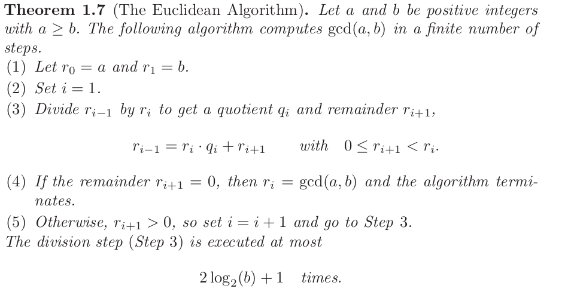
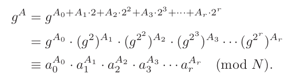
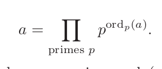
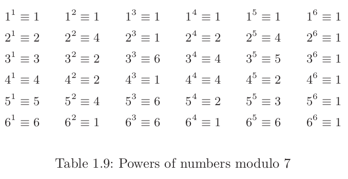

- # book notes:
- Introduction to mathematical cryptography:
- 1.2: Divisibility and greatest common divisors:
	- Set of intergers we use is the symbol *Z*
	- #+BEGIN_QUOTE
	  Set of intergers with their addition and multiplication rules are an  *ring*
	  #+END_QUOTE
	- #+BEGIN_QUOTE
	  Defn: Let *a* and *b* be intergers with b!=0. we say that *b* divides *a* or a is divisible by b if there is such an interger *c* such that *a = bc*
	  #+END_QUOTE
		- [#C] #+BEGIN_QUOTE
		  Proposition: Let *a, b, c in Z* be intergers.
		  (a) if a/b and b/c then a/c   
		  (b) if a/b and b/a then a = +b
		  (c) if a/b and a/c, then a/(b+c) and a/(b-c)
		  #+END_QUOTE
		- #+BEGIN_QUOTE
		  Defn: A common divisor of two intergers *a* and *b* is a positive interger *d* that divides both of them. A greatest common divisior of *a* and *b* is the largest positive *d* such that *d/a* and *d/b*. Denoted as *gcd(a,b)*
		  #+END_QUOTE
		- #+BEGIN_QUOTE
		  Defn: effecient algorithm for computing greatest common divisiors is *division with remainder*. dividing *a* and *b* will get a quotient *q* and remainder *r* where remainder is smaller than *b*
		  #+END_QUOTE
		- #+BEGIN_QUOTE
		  Defn: Division algorithm: let *a* and *b* be positive intergers. Then *a* divided by *b* has quotient *q* and remainder *r* means that 
		  *a = b * q + r* with 0<=r<b
		  #+END_QUOTE
		- #+BEGIN_QUOTE
		  Defn: Eucledian algorithm:repeated divison with remainder
		  #+END_QUOTE
		- 
		- #+BEGIN_QUOTE
		  Proof: The *r_i* values are strictly decreasing and bound to zero when the algorithm terminates. THis is finite steps. Each iteration of step 3 we have equation of form 
		  *r_i-1 = r_i * q_i+r_i+1* 
		  #+END_QUOTE
		- this equation implies that any common divisor of *r_i-1* and *r_i* is also a divisor of *r_i+1* so...
		- #+BEGIN_QUOTE
		  gcd*(r_t-1, r_t)* = gcd(*r_t*q_t, r_t*)=*r_t
		  #+END_QUOTE
		- this is equal to gcd*(r_0, r_1)*  i.e to gcd(*a,b*)
		- nonzero remainder in euclidean algorithm is equal to greatest common divisior of *a* and *b*
		- since *r_i* values are strictly decreasing, the algorithm terminates in most *b* steps.
		- FOr every two iterations of step 4 the value of *r_i* is at least cut in half
		- #+BEGIN_QUOTE
		  In other words: 
		  *r_i+2* < 1/2* *r_i* for all *i* = 0,1,2...
		  #+END_QUOTE
	- id:: 63ea7bec-9092-419f-8b74-91564cdc5767
	  #+BEGIN_QUOTE
	  Extended eucledian algorithm:
	  Let *a* and *b* be positive intergers. Then the equation
	  *au* + *bv* = gcd(*a, b*)
	  always have solutions for intergers *u* and *v*
	  
	  If (*u_0, v_0*) is any one solution, then every solution has form :
	  *u* = *u+0*+ *b * k* / gcd(*a, b*) and *v* = *v_0* - *a* * *k* / gcd(*a,b*)
	  for some *k* in *Z*
	  #+END_QUOTE
		- at each stage of EEA we find that *r_i* is the sum of an interger multiple of *a* and interger multiple of *b*. Eventually we get to *r_t* = *a* * *u* + *b* * *v* for some intergers *u* and *v*
		- Important case of EEA is when gcd of *a* and *b* is 1. In this case we call *a* and *b* *relatively prime*
		- EEA tabular:
		- |||*q_1*|*q_2*|||*q_t-1*|
		  |--|--|--|--|--|--|--|
		  |0|1|*P_1*|*P_2*|...||*P_t-1*|
		  |1|0|*Q_1*|*Q_2*|...||*Q_t-1*|
	- 1.3 Modular arthimatic
		- #+BEGIN_QUOTE
		  Let *m* >= 1 be an interger. We say that intergers *a* and *b* are *congurent modulo m* if their difference *a-b* is divisible by *m*
		  *a≡b* (mod *m*)
		  #+END_QUOTE
		- the number *m* is called the modulus. Numbers satisfying *a*≡0(mod *m*) are numbers divisible by *m*, the multiples of *m*
		- congrunces  behave much like equalities
			- #+BEGIN_QUOTE
			  Let *m* >= 1 be an interger
			  (a) If *a_1* ≡ *a_2* (mod *m*) and *b_1*≡*b_2*(mod *m*) then
			  *a_1* ± *b_1* ≡ *a_2* ± *b_2* (mod *m*) and *a_1* * *b_1* ≡ *a_2* * *b_2* (mod *m*)
			  (b) Let *a* be an interger. Then
			  *a* * b ≡ 1 (mod *m*) for some interger *b* if and only if gcd(*a*, *m*) = 1.
			  If such an interger *b* then we say that *b* is the *multiplicative inverse* of modulo *m*.
			  (any two inverses are congurent modulo *m*)
			  #+END_QUOTE
				- if gcd(*a*,*m*) = 1 then there exists an inverse *b* of *a* modulo *m*. The fraction *b^-1* = 1/*b* then is a meaningful interpretation in the world of integers modulo *m*
				- #+BEGIN_NOTE
				  When *m* is large, it is challenge to compute *a^-1* modulo *m*. They exist by the EEA. In order to actually compute the *u*  and *v* that appear in *au + mv* = gcd(*a, b*) we can apply Eucledian algorithm directly or we can use box method or other algorithm. Since the euclidian algorithm takes only 2 log_2(*b*) + 3 iterations to compute gcd(*a, b*), it takes only a small multiple of log_2(*m*) steps to compute *a^-1* modulo *m*
				  #+END_NOTE
			- If *a* divided by *m* has quotient *q* and remainder *r* it can be written as:
				- *a* = *m* * *q* + *r* with 0 <= *r* <= *m*
					- *a* ≡ *r* (mod *m*) for some interger *r* between 0 and *m* - 1, so if we work with intergers modulo *m*, its enough to use intergers 0 <= *r* <= *m*
				- #+BEGIN_QUOTE
				  Defn: *Z* / *m**Z* = {0,1,2....*m*-1}
				  and call *Z*/*m**Z* the *ring of intergers modulo* *m*
				  #+END_QUOTE
					- whenever we perform addition or multiplication in *Z*/*m**Z* we divide the result by *m* and take the remainder in order to obtain an element in *Z*/*m**Z*
					- #+BEGIN_QUOTE
					  if *a* has an inverse modulo *m* if and only if gcd(*a,m*)=1. Numbers that have inverses are called units. Denote the set of all units as: 
					  (*Z*/*m**Z*)* = {*a* ∈ *Z*/*m**Z*: gcd(*a,m*) = 1}
					                              = {*a* ∈ *Z*/*m**Z*: *a* has inverse modulo *m*}
					  #+END_QUOTE
					- the set (*Z*/*m**Z*)* is called the *group of units modulo *m*
						- if *a_1* and *a_2* are units modulo m then so is *a_1**a_2*, when we multiply two units we always get an unit. When we add two units we often do not get a unit
					-
			- Important to know how many elements are in unit group modulo *m*
			- #+BEGIN_QUOTE
			  *Euler's phi function* or the *toient function* is the function φ(*m*)
			  φ(*m*) = # (*Z*/*m**Z*)* = # {0 <= *a* < *m* : gcd(*a, m*) = 1}
			  #+END_QUOTE
	- 1.3.2 The fast powering algorithm
	- #+BEGIN_QUOTE
	  Step 1: compute the binary expansion of *A* as 
	  *A* = *A_0* + *A_1* * 2 + *A_2* * 2^2 + *A_3* * 2^3 + ... *A_r* * 2^*r* with *A_0*...*A_r* ∈  {0, 1}, where we assume *A_r* = 1
	  Step 2: compute the powers *g^2^i*(mod *N*) for 0<=*i*<=*r* by successive squaring
	  *a_0* ≡ *g* (mod *N*)
	  *a_1* ≡ *a^2*_0 ≡ *g^2* (mod *N*)
	  ...
	  *a_r* ≡ *a^2_r-1* ≡ *g^2^r* (mod *N*)
	  Each term is square of previous one
	  Step 3: Compute *g^A*(mod *N*) using formula:
	   
	  #+END_QUOTE
	- 1.4 Prime numbers, Unique factorization, finite fields
	- #+BEGIN_QUOTE
	  An interger *p* is called a prime if *p* >= 2 if and only if positive intergers dividing *p* are 1 and *p*
	  #+END_QUOTE
	- #+BEGIN_NOTE
	  Let *p* be a prime number, and suppose that *p* divides the product *a**b* of two intergers *a* and *b*. Then *p* divides at least one of *a* and *b*. More generally if *p* divides a product of two intergers *p*/*a_1**a_2*...*a_n*, then *p* divides at least one of the individual *a_i* 
	  #+END_NOTE
	- #+BEGIN_QUOTE
	  Fundemental theorem of arithmetic:
	  Let *a*>=2 be an interger. Then *a* can be factored as a product of prime numbers
	  *a* = *p_1^e_1* * *p_2^e_2* ... *p_r^e_r*
	  #+END_QUOTE
	- this factorization of prime powers will be unique
	- suppose that *a* has two factorizations into products of primes, 
	  *a* = *p_1**p_2*...*p_s* = *q_1**q_2*....*q_t*
	  where *p_i* and *q_j* are all primes, not necssarily distinct, and *s* does not necessarily equal *t*.  *p_1* divides one of *q_i*
	- #+BEGIN_QUOTE
	  the fundmental theorem of arithjmitic says that the factorization of a positive interger *a* into primes, each prime *p* appears to the particular power. We denote this by ord_p(*a*) and call it the *order* (or *exponent*) of *p* in *a*. Ord_p(1) = 0 for all primes.
	  #+END_QUOTE
	-  
	- If *p* is a prime, then every nonzero number modulo *p* has a multiplicative inverse modulo *p*.
	- #+BEGIN_NOTE
	  Let *p* be a prime. Then every nonzero element *a*  in *Z/pZ* has a multiplicative inverse,
	  that is, there is a number *b* satisfying
	  *ab≡1* (mod *p*).
	  this value is denoted *a^-1 mod p* or if we already specified *p*, then just *a^-1*
	  #+END_NOTE
	- #+BEGIN_NOTE
	  extended eucledian algorithm gives computational method for copmputing *a^-1 mod p*,
	  solve the equation 
	  *au* + *pv* = 1 in intergers *u* and *v*
	  and then *u* = *a^-1* mod *p*
	  #+END_NOTE
		- We can restate this by saying that if *p* is prime then:
		  (*Z/pZ*)* = {1,2,3....*p-1*}\
		- When 0 element is removed from *Z/pZ* the remaining elements are units and closed under multiplication
	- #+BEGIN_QUOTE
	  Defn: If *p* is prime, then the set of *Z*/*p**Z* of intergers modulo *p* with addition, substraction, multiplication and division rules is a *fields*.
	  Communative ring in which every nonzero element have a multiplicative inverse.
	  The field of real numbers *R*, field of rational numbers (fractions) *Q* and complex numbers *c*
	  field *Z/pZ* of intergers modulo *p* has finite elements. Finite field! of *F_p* . F_p and Z/pZ are the same thing!!! Theyre also called Galois fields
	  #+END_QUOTE
	-
- 1.5 Powers and primative roots in finite fields.
	- We can raise elements of *F_p* to high powers for cryptography!!
	- do this by the fast powering algorithm above ^^
	- 
	- Right hand collumn is entirely ones!! or...
	- *a*^6 ≡ 1 (mod 7) for every *a* = 1,2,3...6
	- if *a* is multiple of 7; then so is its powers which would mean a n ≡ 0 (mod 7). But if *a* is *not* divisible by 7, then *a* is congruent to values 1,2,3,...6 modulo 7.
	- So...
		- *a*^6 ≡ { 1(mod 7) if 7 not divisible by *a*
		                  { 0(Mod 7) if 7 divisbile by *a*}
		- #+BEGIN_QUOTE
		  Fermats little theormen:
		  Let *p* be a prime number and *a* be any interger
		  then....
		  *a^p-1* ≡ { 1 (mod *p*) if *p* not divisible by *a*
		                       { 0 (mod *p*) if *p* is divisble by *a*}
		  #+END_QUOTE
	-
-
-
- # Lecture notes:
- if *a* and *p* are co-prime then ..
- fermats little theorem! go through proof
- Multiplicative groups are Communative: for each element of *a* of *A* we have value of *m(a)* by finding *f(a)* and find *g(f(a))*, which is the same as *m(a)*, *m* = *fg*
- generator: fermats little theorm gives it *b*^*k*, then we have *b'* = (b^k) we have *b'* = b^e_i
- generator is glued together elements of maximal subgroups
-