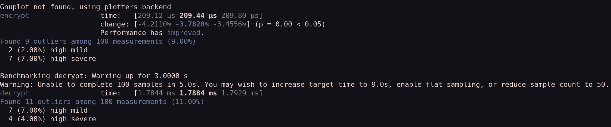

- Notes:
	- Chapter 2:
		-
- Homework:
	- chapter 1:
		- Q10. Describe a concrete example where improving the security of a system against one type of attack can increase the likelihood of other attacks.
			- #+BEGIN_EXAMPLE
			  CVE-2019-11510-people connecting to a "secure" enterprise VPN only for there to specific requests that attackers can send to users on that VPN and perform RCE
			  #+END_EXAMPLE
	- chapter 2:
		- Q3. Consider a group of 30 people who wish to establish pair-wise secure communications using symmetric-key cryptography. How many keys need to be exchanged in total.
			- Handshake lemma: counting number of handshakes in a room with n + 1 people, handshkes once per person. So (n(n - 1) / 2) = 435 keys to exchange.
		- Q4. Suppose Bob receives a message signed using a digital signature scheme with Alice's secret signing key. Does it prove that Alice saw the message and chose to sign.
			- could be adversary that recorded message and secret signing key? might also need numbering scheme alongside signature to fully prove alice signed
			- pg 29: alice trusts the computer to compute the signature,  viruses could infect computer and forge the signatures so nope basically
		- Q6. Suppose a chosen-ciphertext attacker cannot recover the secret decryption key for an encryption scheme. Does this mean the encryption scheme is secure?
			- A "good" encryption algo should be able to easily withstand chosen-plaintexts. Attacker has more freedom in a chosen-ciphnertext attack as you have both plaintext and corresponding plaintext.
				- However theres *other* factors to the security of an algorithm:
					- An attacker could recover info about an message which is *broken* diffusion while still having *successful* confusion. If one bit doesnt change when it should to be secure, thats *bad*
		- Q7. Consider a symmetric-key cryptosystem in which cryptographic keys are randomly selected from the set of all n-bit strings. Approximately what should n be in order to provide 128 bits of security against a birthday attack.
			- pg 34: as there are 2^n possible values you'll need almost sqrt(2^n) = 2^n/2 elements in a set before a collision, which is a birthday bound 2^128/2 = 256.
	- General hw questions:
		- Find two libraries for each of RSA, TLS/SSL, and AEAD. Evaluate the maturity each library, and skim the code. What about the library structure makes sense? How is their documentation?
			- https://github.com/RustCrypto/RSA- seems audited by a third party, dogfoods by using the rust crypto `digest` trait which makes sense. Long comments
			- https://github.com/rustls/rustls- active release schedule alongside build automation and test automation and has bindings for openSSL, apparently is more secure than openssl?
		- Benchmark the speed of an algorithm in the two different implementations with Criterion
			- 
		- Implement the [Vignère cipher](https://en.wikipedia.org/wiki/Vigen%C3%A8re_cipher) in 100 lines or less.
			- owns encrypt() and decrypt() fn
			-
	-