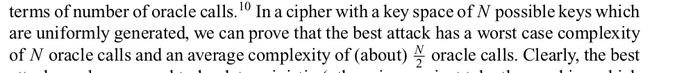

- Notes
	- Current generation (2010) of block ciphers is a block size of 128 bits
	- block ciphers are kinda a very big key-dependent table (in a conceptual type of way)
		- for any fixed key, you compute a lookup table that maps plaintext to cipher text
		- no two entries of the table are the same (otherwise this would be a collision).
		- this is pretty much a permutation: a list of all possible elements where order is different.
		- A block size of k bits specifies the permutations on k-bit values for each of the key vals.
		- takes 2^k possible k-bit inputs and maps each to an unique k-bit output
	- Attacks:
		- Related key attack sounds like making an isomorphism between keys
		- "changes the key for every message by incrementing by one" sounds like bit shifting
		- make sure to cover any type of attack in building cryptography!
	- Defn of block cipher security
		- #+BEGIN_QUOTE
		  Definition 1: A secure block cipher is one for which no attack exists
		  #+END_QUOTE
		-
- Homework
	- 1; How much space would be required to store a table for an entire idealized block cipher that operates on 64-bit blocks and has 80-bit keys?
		- 140 million TB lol (pg 44)?? Nah it could actually be pg 46
	- 5; Suppose you have a processor that can perform a single DES encryption or decryption operation in 2^-26 seconds. Suppose you also have a large number of plaintext-ciphertext pairs for DES under a single unknown key. How many hours would it take, on average, to find that DES key, using an exhaustive search approach and a single processor? How many hours would it take, with a collection of 2^14 processors?
		- (Refer to classical introduction to cryptography)
		- 
		-
		-